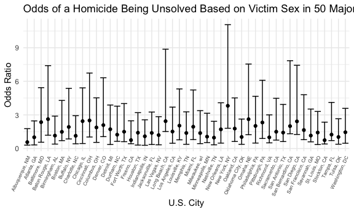
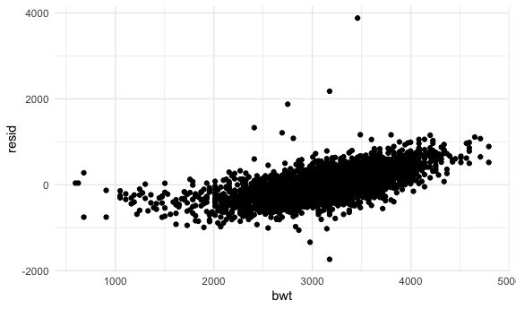
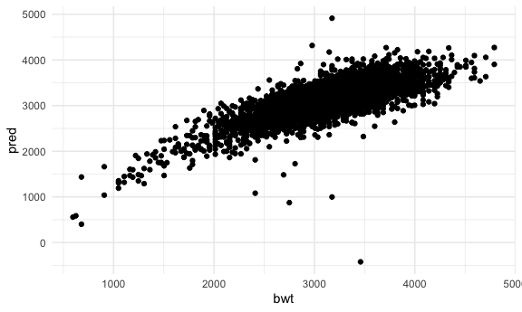
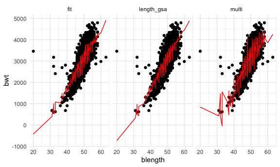
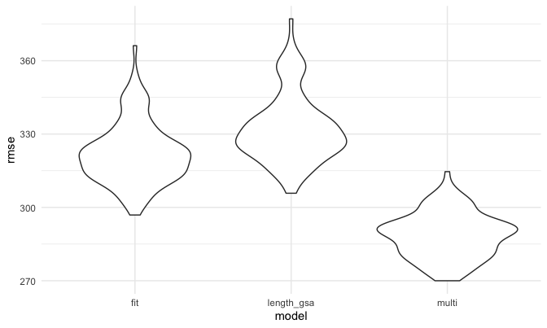

p8105_hw6_af3341
================
Alana Ferris
2022-11-22

# Problem 1

# Problem 2

## Reading in and cleaning homicide data

``` r
homicides = 
  read_csv("./data/homicide-data.csv")

total_homicide = 
  homicides %>% 
  mutate(city = str_replace(city, "$", ", ")) %>% 
  mutate(city_state = 
    paste0(city, state)) %>% 
  mutate(unsolved = 
           case_when(disposition == 'Closed without arrest' | 
                    disposition == 'Open/No arrest' ~ TRUE, 
                    disposition == 'Closed by arrest'~ FALSE)) %>% 
  mutate(
    victim_age = as.numeric(victim_age),
    victim_race = fct_relevel(victim_race, "White"), 
    victim_sex = fct_relevel(victim_sex, "Male")) %>% 
  filter(city_state != "Dallas, TX" && 
         city_state != "Pheonix, AZ" && 
         city_state != "Kansas City, MO" && 
         city_state != "Tulsa, AL") %>% ## for some reason it isn't dropping tulsa, AL
  filter(victim_race == "White" | victim_race == "Black") %>% 
  group_by(city_state)
```

## Fitting glm function to Baltimore

``` r
balt_df = 
  total_homicide %>% 
  filter(city_state == "Baltimore, MD") %>% 
  select(unsolved, victim_age, victim_race, victim_sex)

fit_logistic = 
  balt_df %>%
  glm(unsolved ~ victim_age + victim_race + victim_sex, 
      data = ., 
      family = binomial()) # is this keeping the other variables fixed, problem only interested in est and CI of OR of male and female 
  
 fit_logistic %>%  
   broom::tidy() %>% 
   mutate(
    OR = exp(estimate),
    CI_lower = exp(estimate - 1.96 * std.error),
    CI_upper = exp(estimate + 1.96 * std.error)
  ) %>% 
  select(term, OR, starts_with("CI")) %>% 
  knitr::kable(digits = 3)
```

| term             |    OR | CI_lower | CI_upper |
|:-----------------|------:|---------:|---------:|
| (Intercept)      | 0.743 |    0.490 |    1.126 |
| victim_age       | 1.007 |    1.000 |    1.013 |
| victim_raceBlack | 2.320 |    1.648 |    3.268 |
| victim_sexFemale | 0.426 |    0.325 |    0.558 |

Homicides in which the victim is Black increases odds of the homicide
being unresolved by about 2x compared to victims who are White. Female
victims have about a 60% reduced risk of their case being unsolved.
There is no association between a victim’s age and the odds that their
homicide is unsolved.

## Mapping glm across all cities

``` r
all_cities =
  total_homicide %>% 
  select(unsolved, victim_age, victim_race, victim_sex) %>% 
  filter(city_state != "Tulsa, AL")

all_nested = 
  all_cities %>% 
  nest(data = unsolved:victim_sex)

all_unnested = 
  all_nested %>% 
  mutate(
    glm_cities = map(.x = data, ~glm(unsolved ~ victim_age + victim_race + victim_sex, 
                                     data = .x, 
                                     family = binomial())),
    results = map(glm_cities, broom::tidy)
  ) %>% 
  select(city_state, results) %>% 
  unnest(results) %>% 
  mutate(
    OR = exp(estimate),
    CI_lower = exp(estimate - 1.96 * std.error),
    CI_upper = exp(estimate + 1.96 * std.error)
  ) %>% 
  select(city_state, term, OR, starts_with("CI")) %>% 
  filter(term == "victim_sexFemale")
```

## Plot of estimated ORs and CIs for each city

``` r
all_unnested %>% 
  ggplot(aes(x = reorder(city_state, -OR), y = OR)) +
  geom_point() + 
  geom_errorbar(aes(x = city_state, ymin = OR - CI_lower, ymax = OR + CI_upper)) + 
  theme(axis.text.x = element_text(angle = 65, hjust = 1, size = 6)) +
   labs(
    title = "Odds of a Homicide Being Unsolved Based on Victim Sex in 50 Major U.S. Cities",
    x = "U.S. City",
    y = "Odds Ratio")
```



On average, there is a higher odds of a homicide being unsolved if the
victim is male which we can see because the majority of the odds ratios
for female victims’ homicides being unsolved is below 1.

# Problem 3

## Reading in and cleaning birthweight data

``` r
birthweight = read_csv('./data/birthweight.csv') %>% ## remind rae to do ./ 
  mutate(
    babysex = recode(babysex, `1` = "male", `2` = "female"), 
    babysex = as.factor(babysex), 
    frace = recode(frace, `1` = "white", `2` = "black", `3` = "asian", `4` = "puerto rican", `8` = "other", `9` = "unknown"), 
    frace = as.factor(frace), 
    malform = recode(malform, `0` = "absent", `1` = "present"), 
    malform = as.factor(malform), 
    mrace = recode(mrace, `1` = "white", `2` = "black", `3` = "asian", `4` = "puerto rican", `8` = "other"), 
    mrace = as.factor(mrace)
  ) 
```

## Regression model for birthweight

``` r
fit = birthweight %>% 
  mutate(
    mrace = fct_infreq(mrace),
    babysex = fct_infreq(babysex)) %>% 
    lm(bwt ~ mrace + smoken + babysex + gaweeks + parity + blength, data = .) 

fit %>% 
  broom::tidy() %>% 
  knitr::kable(digits = 4)
```

| term              |   estimate | std.error | statistic | p.value |
|:------------------|-----------:|----------:|----------:|--------:|
| (Intercept)       | -3830.6513 |  100.5337 |  -38.1032 |  0.0000 |
| mraceblack        |  -174.8882 |   10.8087 |  -16.1803 |  0.0000 |
| mracepuerto rican |  -116.9864 |   22.0461 |   -5.3064 |  0.0000 |
| mraceasian        |  -125.0195 |   49.8645 |   -2.5072 |  0.0122 |
| smoken            |    -5.5986 |    0.6901 |   -8.1131 |  0.0000 |
| babysexfemale     |   -20.4035 |    9.8927 |   -2.0625 |  0.0392 |
| gaweeks           |    24.9268 |    1.6870 |   14.7757 |  0.0000 |
| parity            |   132.4372 |   47.7706 |    2.7724 |  0.0056 |
| blength           |   122.2054 |    1.9758 |   61.8516 |  0.0000 |

``` r
modelr::add_residuals(birthweight, fit) %>% 
  ggplot(aes(x = bwt, y = resid)) + 
  geom_point()
```



``` r
modelr::add_predictions(birthweight, fit) %>% 
  ggplot(aes(x = bwt, y = pred)) + 
  geom_point()
```



When building my regression model, I included factors that are
hypothesized to impact birthweight including the mother’s race and
smoking habits, the baby’s sex, gestational age, and number of live
births the mother had prior to this pregnancy.

## 2 models for comparison

``` r
length_gsa =
  birthweight %>% 
  lm(bwt ~ blength + gaweeks, data = .)

multi = birthweight %>% 
  lm(bwt ~ bhead + blength + babysex + bhead * blength + bhead * babysex + blength * babysex + bhead * blength * babysex, data = .)

birthweight %>% 
  gather_predictions(fit, length_gsa, multi) %>% 
  mutate(model = fct_inorder(model)) %>% 
  ggplot(aes(x = blength, y = bwt)) + 
  geom_point() + 
  geom_line(aes(y = pred), color = "red") + 
  facet_wrap(~model)
```



## Cross validation

``` r
cv_df = 
  crossv_mc(birthweight, 100) %>% 
  mutate(
    train = map(train, as_tibble),
    test = map(test, as_tibble)
  )

cv_mutated = 
  cv_df %>% 
  mutate(
    fit = map(train, ~lm(bwt ~ mrace + smoken + babysex + gaweeks + parity + blength, data = .x)),
    length_gsa = map(train, ~lm(bwt ~ blength + gaweeks, data = .x)),
    multi = map(train, ~lm(bwt ~ bhead + blength + babysex + bhead * blength + bhead * babysex + blength * babysex + bhead * blength * babysex, data = .x))) %>% 
  mutate(
    rmse_fit = map2_dbl(fit, test, ~rmse(model = .x, data = .y)),
    rmse_length_gsa = map2_dbl(length_gsa, test, ~rmse(model = .x, data = .y)),
    rmse_multi = map2_dbl(multi, test, ~rmse(model = .x, data = .y)))

cv_mutated %>% 
  select(starts_with("rmse")) %>% 
  pivot_longer(
    everything(),
    names_to = "model", 
    values_to = "rmse",
    names_prefix = "rmse_") %>% 
  mutate(model = fct_inorder(model)) %>% 
  ggplot(aes(x = model, y = rmse)) + geom_violin()
```



Our model seems reasonably fit in comparison to the other two models.
However, the multi-fit model has the lowest RMSE, so is technically the
best fit.
