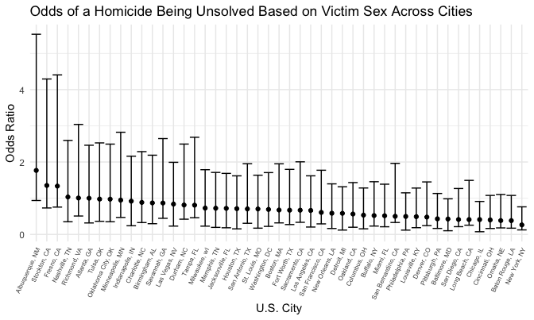

p8105_hw6_af3341
================
Alana Ferris
2022-11-22

# Problem 1

# Problem 2

## Reading in and tidying data

``` r
homicides = 
  read_csv("./data/homicide-data.csv")

total_homicide = 
  homicides %>% 
  mutate(city = str_replace(city, "$", ", ")) %>% 
  mutate(city_state = 
    paste0(city, state)) %>% 
  mutate(unsolved = 
           case_when(disposition == 'Closed without arrest' | 
                    disposition == 'Open/No arrest' ~ TRUE, 
                    disposition == 'Closed by arrest'~ FALSE)) %>% 
  mutate(
    victim_age = as.numeric(victim_age),
    victim_race = fct_relevel(victim_race, "White")) %>% 
  filter(city_state != "Dallas, TX" && 
         city_state != "Pheonix, AZ" && 
         city_state != "Kansas City, MO" && 
         city_state != "Tulsa, AL") %>% ## for some reason it isn't dropping tulsa, AL
  filter(victim_race == "White" | victim_race == "Black") %>% 
  group_by(city_state)
```

## estimate and confidence interval of the adjusted odds ratio for solving homicides comparing male victims to female victims in baltimore

``` r
balt_df = 
  total_homicide %>% 
  filter(city_state == "Baltimore, MD") %>% 
  select(unsolved, victim_age, victim_race, victim_sex)
```

    ## Adding missing grouping variables: `city_state`

``` r
fit_logistic = 
  balt_df %>%
  glm(unsolved ~ victim_age + victim_race + victim_sex, 
      data = ., 
      family = binomial()) 
  
 fit_logistic %>%  
   broom::tidy() %>% 
   mutate(
    OR = exp(estimate),
    CI_lower = exp(estimate - 1.96 * std.error),
    CI_upper = exp(estimate + 1.96 * std.error)
  ) %>% 
  select(term, OR, starts_with("CI")) %>% 
  knitr::kable(digits = 3)
```

| term             |    OR | CI_lower | CI_upper |
|:-----------------|------:|---------:|---------:|
| (Intercept)      | 0.316 |    0.199 |    0.503 |
| victim_age       | 1.007 |    1.000 |    1.013 |
| victim_raceBlack | 2.320 |    1.648 |    3.268 |
| victim_sexMale   | 2.350 |    1.793 |    3.081 |

Homicides in which the victim is Black or Male increases odds of the
homicide being unresolved by about 2x compared to victims who are White
or Female. There is no association between a victim’s age and the odds
that their homicide is unresolved.

## each of the cities in your dataset, and extract the adjusted odds ratio (and CI) for solving homicides comparing male victims to female victims

``` r
all_cities =
  total_homicide %>% 
  select(unsolved, victim_age, victim_race, victim_sex) %>% 
  filter(city_state != "Tulsa, AL")
```

    ## Adding missing grouping variables: `city_state`

``` r
all_nested = 
  all_cities %>% 
  nest(data = unsolved:victim_sex)

all_unnested = 
  all_nested %>% 
  mutate(
    glm_cities = map(.x = data, ~glm(unsolved ~ victim_age + victim_race + victim_sex, 
                                     data = .x, 
                                     family = binomial())),
    results = map(glm_cities, broom::tidy)
  ) %>% 
  select(city_state, results) %>% 
  unnest(results) %>% 
  mutate(
    OR = exp(estimate),
    CI_lower = exp(estimate - 1.96 * std.error),
    CI_upper = exp(estimate + 1.96 * std.error)
  ) %>% 
  select(city_state, term, OR, starts_with("CI")) %>% 
  filter(term == "victim_sexMale")
```

\##Create a plot that shows the estimated ORs and CIs for each city.
Organize cities according to estimated OR, and comment on the plot

``` r
all_unnested %>% 
  mutate(city_state = fct_reorder(city_state, OR)) %>% 
  ggplot(aes(x = city_state, y = OR)) +
  geom_point() + 
  geom_errorbar(aes(x = city_state, ymin = OR - CI_lower, ymax = OR + CI_upper)) + 
  theme(axis.text.x = element_text(angle = 65, hjust = 1, size = 6)) +
   labs(
    title = "Odds of a Homicide Being Unsolved Based on Victim Sex in 50 Major U.S. Cities",
    x = "U.S. City",
    y = "Odds Ratio")
```


